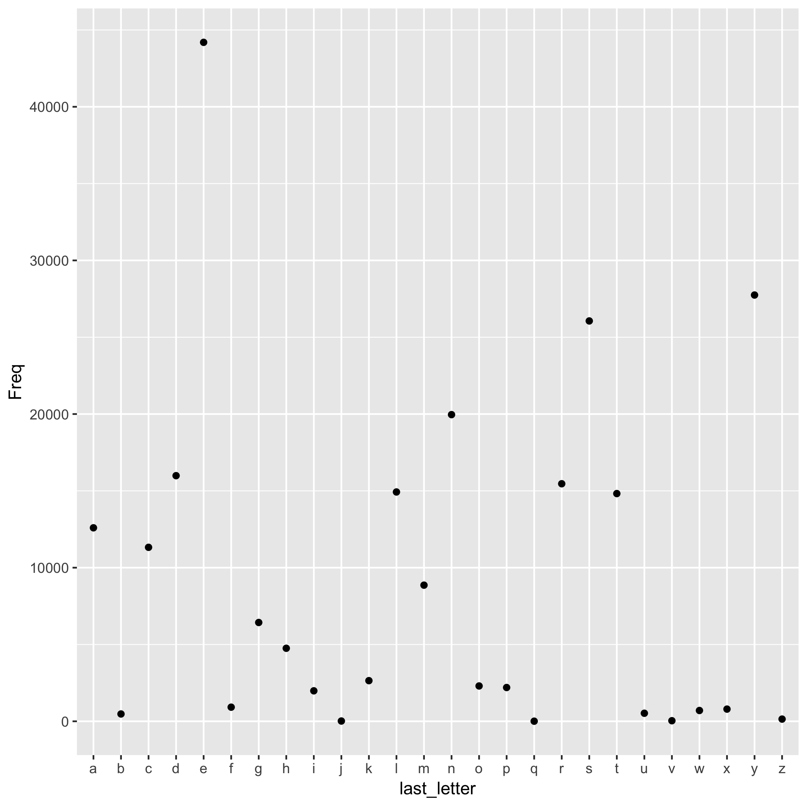

```{r setup, include=FALSE}
knitr::opts_chunk$set(echo = TRUE)
```

Hello!

This report is all about the words file in *nix systems, `/usr/share/dict/words`. 

I calculated the frequency of occurrents of the last letter of each word in the file. 

The scatter plot below shows the number of times each letter in the alphabet is used as the last letter for a word.

The letter with the highest frequency is **s** and the letter with the least frequency is **Q**.


