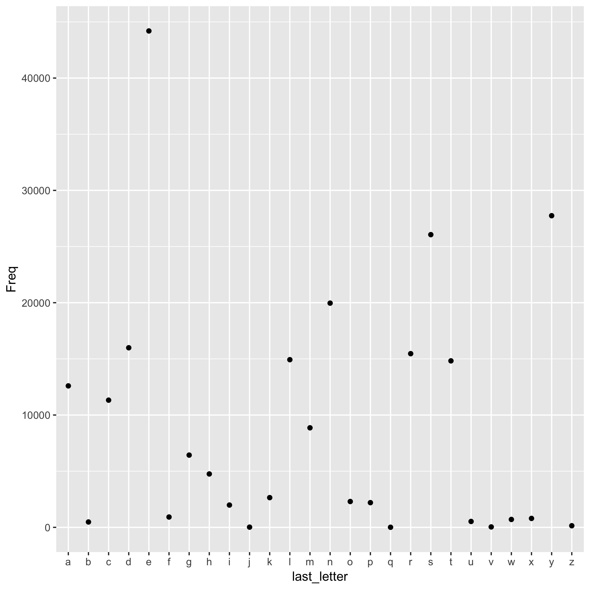

Hello!

This report is all about the words file in *nix systems, `/usr/share/dict/words`. 

The scatter plot below shows the number of times each letter in the alphabet is used as the last letter for a word.

The letter with the highest frequency is **e** with 44195 occurrences, and the letter with the least frequency is **q**, with 7!

